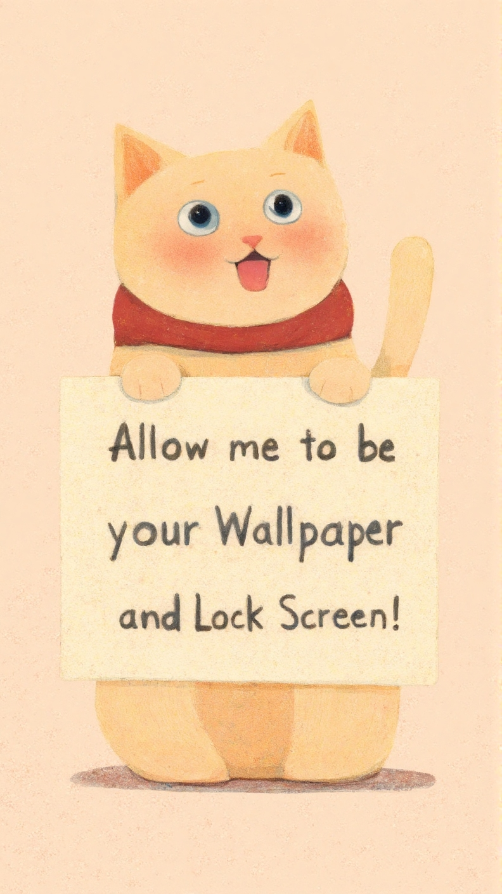

Live video wallpapers for Android focused on wellness and mindful daily moments.

<div align="center">
  <h1>Bunn</h1>
  <p><strong>Live video wallpapers for Android focused on wellness and mindful daily moments.</strong></p>
  <a href="https://play.google.com/store/apps/details?id=de.app.bonn.android">
    
  </a>
</div>

## Quick Overview

**Bunn is an Android live wallpaper app on Google Play.**  
It shows wellness-themed video wallpapers and guides users through permission + wallpaper setup.

- Package: `de.app.bonn.android`
- Platform: Android (`minSdk 26`, `targetSdk 35`)
- Play Store: https://play.google.com/store/apps/details?id=de.app.bonn.android

<p align="center">
  
</p>

## Backdrop Preview

<p align="center">
  
</p>

## Animated Preview

<p align="center">
  
</p>

## Screenshot Gallery

| Notification Permission | Wallpaper Setup |
| --- | --- |
|  |  |

## Highlights

- Live video wallpaper experience designed for daily reflection and wellness
- Smooth onboarding flow: user agreement, permissions, and wallpaper setup
- Built-in About, How-to, and Version screens
- Remote content/version handling with local persistence
- Firebase messaging and AdMob support

## How It Works

1. Accept the user agreement.
2. Grant notification permission (Android 13+).
3. Launch wallpaper setup.
4. Select Bunn as your live wallpaper.
5. Open the app anytime for updates and guidance.

## Android Specs

- Package: `de.app.bonn.android`
- `minSdk`: 26
- `targetSdk`: 35

## Build

```bash
./gradlew :androidApp:assembleDebug
```

## Support

- Email: `bunnwellness@gmail.com`
- Play Store: https://play.google.com/store/apps/details?id=de.app.bonn.android
